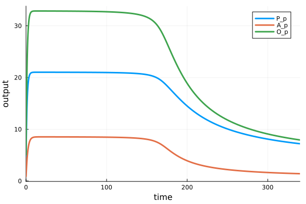
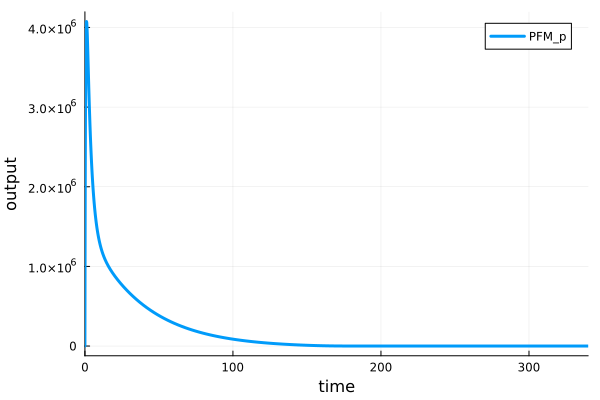
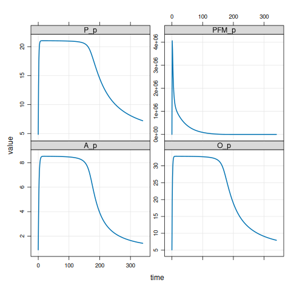

[Back to source repository](https://github.com/insysbio/faah-inhibitor)

## Model build results

This is the result of output results for the QSP platform based on [Heta](https://hetalang.github.io/specifications) and [Heta compiler](https://hetalang.github.io/hetacompiler). 

These files and figures are generated by **GitHub Actions** on each update of the source code
in [master branch](https://github.com/insysbio/faah-inhibitor).

## Results of building
- JSON [.JSON file](./json/output.heta.json)
- YAML [.YML file](./yaml/output.heta.yml)
- XLSX [.XLSX file](./table/output.heta.xlsx)
- SLV [.SLV file](./slv/nameless.slv)
- DBSolve [.SLV file](./dbsolve/nameless.slv)
- **SBML V2L4** [.XML file](./sbml/nameless.xml)
- Simbio [.tar.gz file](./simbio.tar.gz)
- Mrgsolve [.tar.gz file](./mrg.tar.gz)
- HetaSimulator.jl/Julia [.tar.gz file](./julia.tar.gz)
- Matlab [.tar.gz file](./matlab.tar.gz)

## Results of simulations

### HetaSimulator.jl

#### P_p, A_p, O_p

### PFM_p

### mrgsolve

